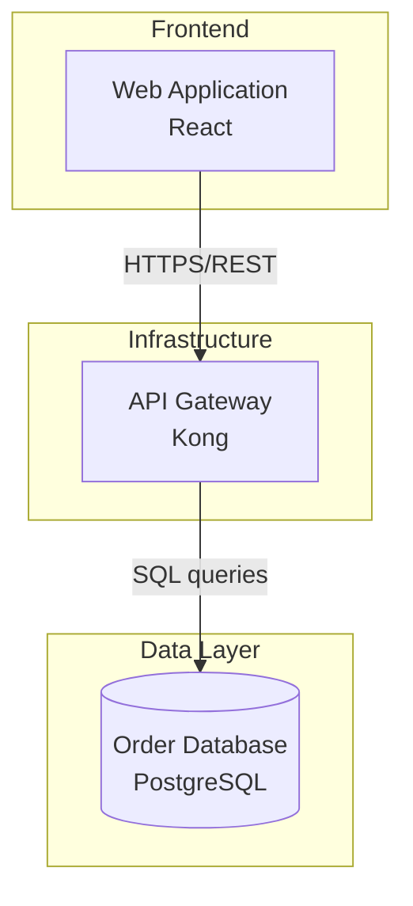
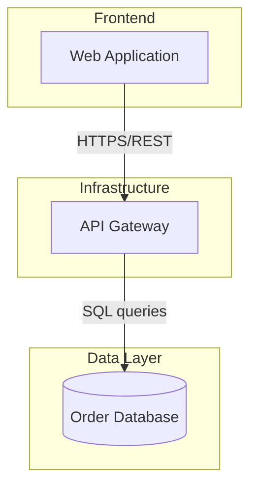

# Proposal: Production-Grade Architecture Diagram Extraction for folio.love

**Date:** 2026-03-14
**Author:** Johnny Oh
**Status:** Draft — awaiting final review before implementation
**Quality bar:** McKinsey client-presentable. Fortune 100 CEO/CIO-level insight. Every extracted diagram must be trustworthy enough to include in a senior client deliverable without manual recreation.

---

## Known Gaps

This proposal specifies the architecture, design decisions, and implementation plan. The following areas are intentionally deferred to implementation, not because they're unimportant, but because they require either empirical data or detailed design work that depends on implementation context. Reviewers should focus on the architecture and decision quality, not the absence of these items.

**Prompts not yet written.** `DIAGRAM_EXTRACTION_PROMPT` (Pass A) and the verification prompt (Pass B) are described in terms of what they request but the actual prompt text is not included. These are the highest-leverage artifacts in the system and will be designed, tested, and iterated during PR 3. The prompt design will incorporate findings from the model comparison testing.

**Tiling region-mapping mechanics not fully specified.** The strategy (global overview → 4 quadrants → escalate to 3×3 if needed) is defined, but the feedback loop is not: how does Pass B identify which regions contain unreadable labels? How are regions mapped back to tile coordinates for re-extraction? This requires defining the spatial reference system between Pass A output and tile geometry.

**Verify/patch data structure and merge logic not defined.** Pass B produces "patches" (adds/removals/edits to the Pass A extraction), but the patch format, merge semantics, and conflict resolution logic are not specified. This will be designed during PR 3 alongside the verification prompt.

**Standalone note versioning and human-override sync.** The proposal defines dual output (deck note + standalone diagram notes) and human override support, but does not specify: what happens to standalone notes on re-conversion? How are human overrides on the standalone note synced (or not) with the deck note's diagram section? This interacts with the existing version tracking system and will be designed during PR 5.

**Batch processing and error recovery not scoped.** The current CLI processes one file at a time. Processing 100+ diagram PDFs needs: progress reporting, per-page error recovery (don't lose 99 results because page 47 hit an API error), aggregate reporting (pages flagged for review, total cost, processing time). This is a separate scope item that builds on the per-file pipeline.

**pdfplumber text extraction on real diagram PDFs not empirically validated.** The text enrichment strategy assumes pdfplumber's `extract_words()` and `page.rects` return useful data for diagram PDFs. No one has tested this on actual diagram files from the target corpus. If most diagrams have outlined text or grouped paths instead of native rects, the text enrichment value and the verify loop's cross-checking premise both weaken. This will be validated empirically before PR 3 implementation begins.

**Multi-diagram pages not addressed.** The proposal assumes one page = one diagram = one standalone note. A single PDF page could contain two diagrams side by side, or a diagram with accompanying text. Handling multi-diagram pages (detection, splitting, separate extraction) is not specified.

---

## 1. Document Lineage

This proposal is built from four layers of input, each correcting and refining the previous.

### Layer 1: Codebase Context Brief
A factual export of the folio.love pipeline produced by Claude Code with full codebase access. Described the current pipeline stages, code paths, data structures, configuration surface, dependencies, and known behavior on diagram PDFs. No recommendations — facts only.

### Layer 2: Three Independent Deep Research Reports
The same research prompt (grounded in the context brief) was run through three deep research tools, labeled blind as Model A, Model G, and Model O to prevent bias.

**Model A** — *"Extracting architecture diagrams from PDF into structured knowledge"*
- Position: Vision-LLM-primary approach is sufficient. Cites Flowchart2Mermaid benchmark (December 2025) showing entity F1 >0.94, relationship F1 ~0.91-0.93 for frontier models.
- Key contributions: Most optimistic on LLM-only extraction. Provided specific cost analysis ($0.02-0.03/page with Sonnet). Recommended pre-resize to 1568px longest edge before API call. Proposed Canny edge detection for blank detection. Reported Mermaid syntax validity scores of 0.998-1.0 for top models after repair loop.

**Model G** — *"Deep Research: Architecture Diagram Extraction from PDF into Structured Knowledge"*
- Position: Hybrid extraction (PDF parsing + vision LLM) is strictly necessary. Argues vision LLMs suffer from a "binding problem" where they identify elements but fail to associate labels with shapes in dense diagrams.
- Key contributions: Introduced Compositional Chain-of-Thought (CCoT) prompting strategy for spatial reasoning. Noted Mermaid's token efficiency (up to 24x fewer tokens than XML/JSON formats). Observed that Obsidian can't natively query deep JSON without plugins, recommending Markdown tables for component data. Claimed Claude has superior prompt adherence for structured extraction (sourcing unclear for diagram-specific tasks).

**Model O** — *"Deep Research: Architecture Diagram Extraction from PDF into Structured Knowledge"*
- Position: Hybrid is necessary, and even hybrid has hard limits. Cites system-maps evaluation with best edge+polarity F1 of 0.62 for JSON output. Argues edge extraction is fundamentally harder than node extraction.
- Key contributions: Most technically rigorous. Proposed tiling/cropping strategy for small-text recovery. Recommended pypdfium2 as secondary extractor. Added `source_text` provenance field and `uncertainties` list to schema. Flagged Poppler GPL licensing issue. Only report to propose an extract → verify → patch loop. Cited vendor-specific image handling documentation (Claude resize thresholds, GPT-4o detail levels, Gemini media_resolution parameter).

### Layer 3: Research Consolidation
Blind synthesis of the three reports, weighting them equally. Identified seven areas of consensus, five areas of meaningful disagreement, and standout findings unique to each report. Proposed implementation plan and post-implementation testing strategy.

### Layer 4: Codebase Review (Claude Code + Codex)
The consolidation was reviewed against the actual codebase by Claude Code with full repo access. This review caught critical issues that override several research recommendations:

**Factual corrections:**
- Blank detection heuristic is used in TWO call paths (`extract_with_metadata()` and `_validate_image()` in `images.py:132-181`), not one.
- Blank slides are also excluded from Pass 2 via `skip_slides=blank_slides` at `converter.py:203-220` — the consolidation understated the blast radius.
- Actual pipeline order: normalize → images → text-from-original-source → pass1 → optional pass2 → source/version tracking → frontmatter → markdown → registry (at `converter.py:112-340`). The consolidation missed Pass 2 and the source-type branch.
- Text extraction branches by source type: PPTX goes through MarkItDown (`_extract_pptx()`), PDF goes through pdfplumber. Only the PDF path is relevant here.

**Architecture-breaking discovery:**
- Folio produces one Markdown note per deck with per-slide sections, not one note per page. `type: evidence` is hardcoded in frontmatter at `frontmatter.py:97-118`. A per-page `type: diagram` would break frontmatter validation at `tests/validation/validate_frontmatter.py:17-29`, versioning, registry behavior, and markdown assembly.

**Data model insight:**
- All downstream consumers assume `dict[int, SlideAnalysis]`. Cache serialization, Pass 2 routing, frontmatter generation, and markdown assembly all depend on this type. Creating a separate `DiagramAnalysis` class would require changing every consumer.

**Hidden interactions surfaced:**
- `_collect_unique()` at `frontmatter.py:160-179` excludes analyses with all-unvalidated evidence. Diagram pages with vision-only evidence would silently disappear from aggregated frontmatter.
- `_generate_tags()` at `frontmatter.py:234-263` receives but ignores `slide_types`. Diagram tagging needs explicit new logic.
- Pass 2 (density scoring, deep prompt, data-heavy heuristics at `analysis.py:623-695` and `analysis.py:732-924`) is consulting-slide-specific and doesn't map to diagrams.
- `ProviderInput` at `llm/types.py:21-32` supports only one `image_path`. Tiling requires changing the provider abstraction.
- Cache validation at `analysis.py:1097-1154` checks one file-level `ANALYSIS_PROMPT` hash. Mixed diagram/slide prompts per page would break this.
- No Mermaid parser or `mmdc` exists in the repo. Syntax validation is a new dependency.
- The `SlideText` and `_build_text_context()` seam at `analysis.py:146-155` is the existing text-to-prompt injection point. Diagram text should plug into this, not create a parallel path.

### Layer 5: Executive Decisions
The following decisions were made after reviewing the consolidation and code review:

- **Architecture: Model O's hybrid pipeline.** Extract → verify → patch loop. Cost and processing time are not constraints. Quality is the only priority.
- **Image strategy: Model O's tiling.** Global overview plus zoomed quadrant crops. All frontier models resize internally; tiling ensures small labels are captured.
- **Validation: Model O's verify/patch loop + Mermaid syntax validation via `mmdc`.** Two-pass LLM extraction with cross-checking against extracted text inventory, plus syntactic Mermaid validation with auto-repair.
- **LLM selection: Test on corpus during implementation.** Pipeline is model-agnostic via existing provider abstraction. Run structured comparison across Claude, GPT-4o/5, Gemini after pipeline works.
- **Output model: Dual output.** One-note-per-deck (existing) plus standalone diagram notes for diagram pages. Diagrams are first-class knowledge objects.
- **Human review gate: Yes.** Flag low-confidence extractions. Support human override at any stage.
- **Cost posture: quality-first, no cost gating.** Expected cost is ~$0.50-1.50 per diagram page. The system should always perform the most thorough extraction possible. If a dense diagram needs additional tiling passes or extra repair iterations, it runs them. There is no per-page budget cap. Actual costs are tracked in extraction metadata for visibility, not for throttling.
- **Processing time: no constraint.** Expected 20-60 seconds per page. Batch processing overnight if needed.
- **Licensing: Keep Poppler for rendering; add pypdfium2 for diagram text extraction.** pdf2image calls Poppler as a subprocess (GPL doesn't propagate). pypdfium2 adds superior bounded text extraction under Apache-2.0/BSD-3.

---

## 2. Problem Statement

Folio.love cannot meaningfully process standalone PDF files containing architecture diagrams. Four problems cause this:

1. **Text in shapes is lost.** `pdfplumber`'s `page.extract_text()` with defaults captures flowing paragraph text only. Component labels, box titles, and connection annotations inside shapes are not extracted. For a diagram with 20 labeled boxes, the extraction may return nothing or only a page title.

2. **Sparse diagrams are destroyed.** The pixel histogram blank detector (`>95% near-white → blank`) fires on line-on-white diagrams. The blank override at `converter.py:198-201` replaces the LLM analysis with `SlideAnalysis.pending()`, discarding correct results. These pages are also excluded from Pass 2 via `skip_slides`.

3. **Schema doesn't fit.** `SlideAnalysis` has 7 consulting slide types and 13 framework options. No fields for diagram components, connections, hierarchy, or diagram type.

4. **Prompts don't ask the right questions.** `ANALYSIS_PROMPT` asks for consulting framework classification. Architecture diagrams don't fit these categories. The LLM receives no instruction to identify nodes, edges, containment, or flow direction.

---

## 3. Research Consensus (Settled)

All three research reports agreed independently on these points.

**Mermaid is the target diagram-as-code format.** Native Obsidian rendering without plugins, MIT license, highest LLM generation reliability, broadest diagram type coverage (12+ types), token-efficient (up to 24x fewer tokens than XML/JSON formats per Model G). PlantUML (GPL, Java dependency), D2 (requires Obsidian plugin), and Structurizr DSL (too rigid, C4 only) are rejected by all three reports.

**300 DPI for diagram pages.** 150 DPI blurs small labels (8pt text is ~15-20px tall, characters blur after anti-aliasing). 300 DPI is the sweet spot (~30-40px for 8pt text). Higher wastes resources since LLMs internally resize to ~1500-2000px. All three reports agree on 300 DPI.

**pdfplumber `extract_words()` should replace `extract_text()` for diagrams.** Returns word-level bounding boxes. Enables shape-text association, ground-truth labels for the LLM, and post-hoc validation.

**PDF object counting is the right blank/diagram heuristic.** `len(page.rects) + len(page.lines) + len(page.curves)` via pdfplumber. Free, instant, no rendering required.

**Heavyweight ML models and GPU OCR aren't worth the dependency weight.** DocLayout-YOLO, PaddleOCR, Surya, custom models all rejected. Cloud vision LLMs handle the heavy lifting.

**Source image must always be embedded.** No extraction is perfect. The original PNG is the canonical reference and fallback.

---

## 4. Design Decisions

Each decision shows what the research proposed, what the code review corrected, and the final resolution.

**Governing principle: the system always does the most thorough extraction possible.** No step in the pipeline makes a quality/cost tradeoff. If a diagram is complex, the system spends more LLM calls, more tiles, more repair passes. Cost and processing time are tracked for transparency, never used to gate or throttle extraction quality.

### 4.1 Extraction Architecture: Hybrid Extract → Verify → Patch

**Research disagreement:** Model A said vision-LLM-only is sufficient (entity F1 >0.94). Model G said hybrid is strictly necessary ("binding problem"). Model O said hybrid is necessary and even hybrid has hard limits (edge+polarity F1 ~0.62).

**Executive decision:** Model O's approach. At the quality bar of McKinsey client-presentable, the most technically rigorous option is the only acceptable one. Edge extraction is the known failure point; a verify/patch loop directly addresses it. Cost is not a constraint.

**Pipeline:**
```
Pass A (Extract):    Image tiles + PDF text → LLM → structured JSON + Mermaid + prose
Pass B (Verify):     Extracted data + text inventory → LLM → verification report + patches
Pass C (Repair):     If Mermaid invalid or coverage < threshold → LLM → targeted fixes
```

### 4.2 Image Strategy: Tiling

**Research disagreement:** Model A said single image pre-resized to 1568px. Model G said single image with CCoT prompting. Model O said global overview plus zoomed quadrant crops.

**Executive decision:** Model O's tiling. All frontier LLMs resize internally. A small label in the corner of a full-page image gets lost after downsampling. Tiling ensures every region is seen at sufficient resolution. For dense diagrams where 4-quadrant tiling still misses labels (flagged in Pass B), the system escalates to a 3×3 grid automatically.

**Tiling strategy:**
1. Render page at 300 DPI
2. Send global overview (resized to ~1568px longest edge)
3. Send 4 quadrant crops (2×2 grid, each at native 300 DPI resolution)
4. If Pass B flags unreadable labels or low text coverage in specific regions, automatically escalate to 3×3 grid tiling and re-extract affected regions
5. Targeted high-resolution crops for any remaining flagged areas

### 4.3 Output Model: Dual — Deck Note + Standalone Diagram Notes

**Research proposed:** Per-page diagram notes with `type: diagram`.
**Code review said:** Per-page notes break the storage model, frontmatter validation, versioning, registry, and assembly.
**Resolution:** Both. This is not either/or.

- **Deck-level note** (existing model): One note per source PDF. Contains all slide/page sections in sequence, preserving narrative context. Diagram pages get rich sections with Mermaid, components, and connections. Frontmatter stays `type: evidence` with aggregated diagram metadata.
- **Standalone diagram notes** (new): For each page classified as a diagram, emit a separate note as a first-class knowledge object. Has its own frontmatter (`type: diagram`), full Mermaid rendering, component/connection detail, and a backlink to the deck note. This makes each diagram independently queryable, linkable, and visible in Obsidian's graph view.

The deck note's diagram section contains a wiki link to the standalone note. The standalone note links back to the deck. Cross-referencing, not duplication.

**Implication:** This requires adding `type: diagram` to the frontmatter validator's allowed types. It requires a new note emitter alongside the existing markdown assembler. The deck-level assembler stays unchanged except for adding a link to the standalone note.

### 4.4 Extend `SlideAnalysis` with Diagram Fields

**Research proposed:** New `DiagramAnalysis` data class.
**Code review said:** All downstream consumers assume `dict[int, SlideAnalysis]`. Cache, Pass 2, frontmatter, markdown all break with a new type.
**Decision:** Extend `SlideAnalysis` with optional diagram fields. Use `slide_type="diagram"` as discriminator.

New optional fields on `SlideAnalysis`:
```
diagram_type: Optional[str]          # system_architecture, flowchart, data_flow, sequence,
                                     # erd, org_chart, network_topology, unknown
nodes: Optional[list[dict]]          # [{id, label, kind, group, technology, source_text}]
edges: Optional[list[dict]]          # [{source, target, label, direction, confidence}]
groups: Optional[list[dict]]         # [{name, contains: [node_ids]}]
mermaid: Optional[str]               # validated Mermaid.js code
description: Optional[str]           # prose summary for full-text search
uncertainties: Optional[list[str]]   # extraction quality issues for human review
extraction_confidence: Optional[float]  # overall confidence score
review_required: Optional[bool]      # flag for human review queue
```

Each node includes `source_text: "pdf_native" | "ocr" | "vision"` (Model O's provenance tracking). Each edge includes `confidence: float` for the verify/patch loop to populate.

### 4.5 Human Review Gate

**Decision:** Flag low-confidence extractions for mandatory human review.

Criteria for `review_required = True`:
- `extraction_confidence` below threshold (calibrated empirically, starting at 0.80)
- Any items in `uncertainties` list
- Edge coverage (edges found vs edges expected based on node count) below threshold
- Mermaid required repair (even if repair succeeded — indicates extraction difficulty)

The system generates a review queue: a Dataview query in Obsidian that surfaces all diagram notes with `review_required: true`, sorted by confidence. In-house architects review and override as needed.

**Human override support:** Diagram notes include a `human_overrides` frontmatter field. When an architect corrects an extraction, they edit the note directly. The override is preserved across re-processing (folio already preserves certain frontmatter fields on re-conversion via `existing_frontmatter` parameter).

### 4.6 Mermaid Validation + Auto-Repair (Hard Requirement)

**Previously deferred. Now required.**

Add `mmdc` (Mermaid CLI, MIT license, npm package `@mermaid-js/mermaid-cli`) as an optional dependency. After every Mermaid generation:

1. Write Mermaid code to temp file
2. Run `mmdc --validate` (or equivalent parse check)
3. If valid: done
4. If invalid: send error message + original Mermaid to LLM for repair (one attempt)
5. Re-validate
6. If still invalid: omit Mermaid block, set `review_required = True`, add to `uncertainties`

Model A reported syntax validity scores of 0.998-1.0 for top models after repair, so the repair path should rarely be needed but is essential at this quality bar.

### 4.7 Per-Page DPI via Selective Rendering

**Code review said:** `convert_from_path()` renders all pages at one DPI. Per-page DPI is a real refactor.
**Decision:** Do the refactor. Quality requires it.

For diagram pages, render at 300 DPI. For text/slide pages, render at 150 DPI. This requires changing `images.py` to either:
- (a) Render pages individually via `convert_from_path(first_page=N, last_page=N, dpi=...)`, or
- (b) Render all at 300 DPI and accept the overhead (simpler, and processing time is not a constraint)

Option (b) is simpler and avoids the refactor. At the stated "processing time is not a constraint" scope, rendering all pages at 300 DPI is the pragmatic choice. The extra rendering time is seconds, not minutes.

### 4.8 Provider Abstraction for Tiling

**Code review said:** `ProviderInput` at `llm/types.py:21-32` only supports one `image_path`. Tiling requires changing the provider abstraction.

**Decision:** Extend `ProviderInput` to support multiple images:
```python
@dataclass(frozen=True)
class ProviderInput:
    image_path: Path              # primary image (backward compatible)
    prompt: str
    max_tokens: int = 4096        # increased from 2048 for diagram output
    additional_images: tuple[Path, ...] = ()  # tile images for diagram extraction
```

Provider adapters (Anthropic, OpenAI, Google) updated to include all images in the message content array. This is a clean extension that doesn't break existing slide analysis.

**Provider-specific optimizations** (from Model O's vendor documentation findings):
- Claude: send images within documented size thresholds to avoid internal downscaling
- GPT-4o: use `detail: "high"` for diagram tiles
- Gemini: use `media_resolution: "high"` for diagram tiles

### 4.9 Cache Architecture for Mixed Prompts

**Code review said:** Cache validation checks one file-level `ANALYSIS_PROMPT` hash. Mixed diagram/slide prompts per page would break this.

**Decision:** Add a per-entry prompt discriminator to the cache. Each cached analysis entry includes a hash of the prompt that produced it. Cache validation checks per-entry, not file-level. This ensures:
- Re-processing a deck doesn't invalidate diagram analyses just because the slide prompt changed (or vice versa)
- Different DPI renders produce different image hashes, causing automatic cache misses when DPI changes

### 4.10 Pass 2 Handling for Diagrams

**Code review said:** Pass 2 density scoring and deep prompts are consulting-slide-specific.

**Decision:** Diagram pages get their own depth logic, separate from the existing Pass 2:
- The extract → verify → patch loop (Passes A/B/C in Section 4.1) IS the diagram depth pass
- Diagram pages are excluded from the existing slide-oriented Pass 2 via `skip_slides`
- The `--passes` CLI flag behavior: `--passes 1` runs Pass A only (extract, no verify). `--passes 2` runs the full A/B/C loop for diagrams and the existing deep pass for slides

### 4.11 Add pypdfium2 for Diagram Text Extraction

**Decision:** Add pypdfium2 (Apache-2.0/BSD-3) as an optional dependency for diagram text extraction. Use it alongside pdfplumber, not as a replacement.

pypdfium2 provides:
- `PdfTextPage.get_text_bounded()` — extract text within a bounding region
- `count_chars()` — fast zero-text detection
- `get_charbox()` — per-character bounding boxes

**Usage in pipeline:**
- pdfplumber: page-level object counting (rects, lines, curves, chars) for classification
- pypdfium2: bounded text extraction for diagram pages (better signal for text-in-shapes)
- Both feed into the text inventory that the LLM receives as ground-truth context

### 4.12 Handling `_collect_unique()` and `_generate_tags()`

**Code review found:** Vision-only evidence may never validate, causing diagram metadata to silently disappear from deck-level frontmatter. Tag generation ignores slide types.

**Decision:**
- `_collect_unique()`: Diagram analyses (identified by `slide_type="diagram"`) are always included in aggregation regardless of evidence validation status. Vision-based extraction IS the evidence for diagrams.
- `_generate_tags()`: Add explicit diagram tag logic. Extract tags from: `diagram_type`, node labels that appear to be technology names (e.g., "PostgreSQL", "Kubernetes"), and any technology fields from the node data.

---

## 5. System Architecture

### End-to-End Pipeline for Diagram Pages

```
PDF Input
    │
    ▼
Stage 0: Normalize (existing)
    │   normalize.to_pdf() → PDF
    │
    ▼
Stage 1: Page Inspection (new)
    │   inspect.inspect_pages(pdf_path) → dict[int, PageProfile]
    │   pdfplumber: count chars, words, rects, lines, curves per page
    │   pypdfium2: bounded text extraction, char boxes for diagram pages
    │   Classification: blank | text | diagram | mixed
    │
    ▼
Stage 2: Image Extraction (modified)
    │   All pages at 300 DPI (simplest; processing time not a constraint)
    │   For diagram pages: generate tile crops (global + 2×2 quadrants)
    │   Blank detection uses PageProfile, not pixel histogram
    │
    ▼
Stage 3: Text Extraction (modified)
    │   Text pages: existing pdfplumber extract_text() path
    │   Diagram pages: extract_words() with coords + pypdfium2 bounded extraction
    │   Output: SlideText with full_text populated from word inventory
    │   Feeds through existing _build_text_context() seam
    │
    ▼
Stage 4a: LLM Pass A — Extract (modified for diagrams)
    │   Text pages: existing ANALYSIS_PROMPT (unchanged)
    │   Diagram pages: DIAGRAM_EXTRACTION_PROMPT
    │     Input: global image + tile images + text inventory
    │     Output: structured JSON (nodes, edges, groups, mermaid, description)
    │     Uses extended ProviderInput with additional_images
    │
    ▼
Stage 4b: LLM Pass B — Verify (new, diagram pages only)
    │   Input: Pass A extraction + text inventory from Stage 3
    │   LLM checks:
    │     - Do all node labels match extracted text? Flag mismatches.
    │     - Do all edge endpoints exist in node list? Flag orphans.
    │     - Are there extracted text strings not present in any node? Flag gaps.
    │   Output: verification report + patches (adds/removals/edits)
    │   Applied to Pass A output
    │
    ▼
Stage 4c: Mermaid Validation + Repair (new, diagram pages only)
    │   Validate via mmdc
    │   If invalid: send error + Mermaid to LLM for repair (one attempt)
    │   If still invalid: omit Mermaid, flag for review
    │
    ▼
Stage 4d: Confidence Scoring + Review Flagging (new)
    │   Compute extraction_confidence from:
    │     - Text inventory coverage (% of extracted words found in nodes)
    │     - Edge density plausibility
    │     - Mermaid validation result
    │     - Uncertainty count
    │   Set review_required if confidence < threshold
    │
    ▼
Stage 5: Existing Pass 2 (text/slide pages only)
    │   Diagram pages excluded via skip_slides
    │
    ▼
Stage 6: Output Assembly (modified)
    │   Deck-level note: existing assembler + diagram sections with wiki links
    │   Standalone diagram notes: new emitter for each diagram page
    │   Mermaid blocks, component lists, connection lists, prose, uncertainties
    │
    ▼
Stage 7: Frontmatter (modified)
    │   Deck note: type: evidence (unchanged), adds diagram_types, diagram_components
    │   Diagram notes: type: diagram (new allowed type)
    │   _collect_unique() handles vision-only evidence
    │   _generate_tags() includes diagram metadata
    │
    ▼
Stage 8: Source/Version Tracking + Registry (existing, extended)
    │   Standalone diagram notes tracked alongside deck notes
```

### Standalone Diagram Note Structure

```markdown
---
type: diagram
diagram_type: system_architecture
title: "Order Processing System Architecture"
source_deck: "[[20260314-system-design-review]]"
source_page: 7
extraction_confidence: 0.91
review_required: false
components:
  - Web Application
  - API Gateway
  - Order Database
technologies:
  - React
  - Kong
  - PostgreSQL
tags:
  - diagram
  - architecture
  - microservices
  - order-processing
human_overrides: {}
_extraction_metadata:
  model: claude-sonnet-4-20250514
  passes: [extract, verify, repair]
  text_sources: [pdf_native, vision]
  tile_count: 5
---

# Order Processing System Architecture

Extracted from [[20260314-system-design-review]], page 7.

## Diagram



## Components

| Component | Type | Technology | Group | Source |
|-----------|------|------------|-------|--------|
| [[Web Application]] | service | React | Frontend | pdf_native |
| [[API Gateway]] | service | Kong | Infrastructure | pdf_native |
| [[Order Database]] | datastore | PostgreSQL | Data Layer | vision |

## Connections

| From | To | Label | Direction | Confidence |
|------|----|-------|-----------|------------|
| Web Application | API Gateway | HTTPS/REST | → | 0.95 |
| API Gateway | Order Database | SQL queries | → | 0.92 |

## Summary

Three-tier architecture separating frontend, routing infrastructure, and persistence.
The API Gateway centralizes authentication and rate limiting. All communication is
synchronous REST over HTTPS, with direct SQL access to the persistence layer.

## Extraction Notes

> No uncertainties flagged. All component labels confirmed against PDF text layer.

---

![[system-design-review-p007.png]]
```

### Deck Note Diagram Section (Within Existing Per-Slide Structure)

```markdown
### Slide 7


**Diagram: [[20260314-system-design-review-diagram-p007|Order Processing System Architecture]]**



**Components:** [[Web Application]], [[API Gateway]], [[Order Database]]

**Summary:** Three-tier architecture separating frontend, routing, and persistence.

*Full extraction details: [[20260314-system-design-review-diagram-p007]]*
```

### Human Review Queue (Obsidian Dataview Query)

```dataview
TABLE
  diagram_type AS "Type",
  extraction_confidence AS "Confidence",
  length(uncertainties) AS "Issues",
  source_deck AS "Source"
FROM #diagram
WHERE review_required = true
SORT extraction_confidence ASC
```

---

## 6. Implementation Plan

Five production-grade PRs, shipped incrementally. Each PR is independently testable and deployable. Quality bar: every PR ships with full test coverage, no regressions on the existing 506-test suite, and documentation.

### PR 1: Page Inspection + Blank Detection Fix

**Effort:** 1-1.5 days
**Goal:** Stop destroying diagram pages. Establish the pipeline seam for all future diagram work. Add pypdfium2 for text extraction.

**Deliverables:**
- New module `folio/pipeline/inspect.py` with `inspect_pages()` function
- `PageProfile` dataclass with: text_chars, text_words, vector_count, has_images, page_type, extracted_words (with bounding boxes from pypdfium2)
- Classification logic: blank | text | diagram | mixed
- Converter integration: inspection runs after normalize, before images
- Blank detection uses PageProfile, not pixel histogram. `_is_mostly_blank()` becomes advisory (metadata only, never gates LLM output)
- The post-LLM blank override at `converter.py:198-201` gated by PageProfile: only override if page inspection also says blank
- pypdfium2 added as dependency for bounded text extraction on diagram pages

**Tests:**
- Unit tests for `inspect_pages()` with mocked pdfplumber/pypdfium2 pages
- Integration test: sparse diagram page is NOT overridden with `pending()`
- Integration test: truly blank page IS correctly identified
- PDF fixtures: truly blank page, sparse line diagram, dense diagram, text-heavy page

### PR 2: Provider Abstraction + Tiling + DPI

**Effort:** 1.5-2 days
**Goal:** The LLM sees every part of every diagram at sufficient resolution.

**Deliverables:**
- `ProviderInput` extended with `additional_images: tuple[Path, ...]` and increased `max_tokens` (4096)
- All three provider adapters (Anthropic, OpenAI, Google) updated to include multiple images in message content
- Provider-specific optimizations: GPT-4o `detail: "high"`, Gemini `media_resolution` parameter
- Tiling module: generates global overview (resized to ~1568px) + quadrant crops from 300 DPI render
- DPI raised to 300 globally (simplest approach given processing time is not a constraint)
- Tile paths stored alongside slide images for cache and re-processing

**Tests:**
- Unit tests for tiling (correct crop coordinates, correct file output)
- Provider adapter tests for multi-image payloads
- Integration test: diagram page produces global + 4 tile images

### PR 3: Diagram Extraction Prompt + Schema Extension + Cache

**Effort:** 2-2.5 days
**Goal:** When a diagram page is detected, the LLM is asked the right questions and produces structured, verifiable output.

**Deliverables:**
- `SlideAnalysis` extended with optional diagram fields (diagram_type, nodes, edges, groups, mermaid, description, uncertainties, extraction_confidence, review_required)
- `to_dict()`, `from_dict()`, serialization all handle new fields
- `DIAGRAM_EXTRACTION_PROMPT` — detailed prompt requesting JSON with all diagram fields, including:
  - "Use exact text labels. Do not paraphrase."
  - "Flag uncertain elements in uncertainties list."
  - "For each edge, state direction based on visible arrowheads. Use 'unknown' if unclear."
  - "Generate valid Mermaid.js code."
  - Text inventory included via existing `_build_text_context()` seam
- `_analyze_single_slide()` routes to diagram prompt when page is classified as diagram
- Pass A (extract) + Pass B (verify/patch) implemented as sequential LLM calls for diagram pages
- Confidence scoring: computes extraction_confidence from text coverage, edge plausibility, uncertainty count
- Review flagging: sets `review_required` based on confidence threshold
- Per-entry prompt discriminator added to cache key
- Diagram pages excluded from existing Pass 2 via `skip_slides`
- Diagram text extraction: `extract_words()` via pdfplumber + pypdfium2 bounded extraction, concatenated into SlideText.full_text for diagram pages

**Tests:**
- Unit tests for SlideAnalysis serialization with diagram fields
- Unit tests for prompt routing (diagram vs slide)
- Unit tests for Pass B verification logic
- Unit tests for confidence scoring
- Mock LLM response tests for diagram JSON parsing
- Cache tests: diagram and slide analyses don't collide
- Cache tests: prompt discriminator works correctly

### PR 4: Mermaid Validation + Auto-Repair

**Effort:** 1 day
**Goal:** Every Mermaid block in the output is syntactically valid or explicitly flagged.

**Deliverables:**
- `mmdc` (Mermaid CLI) integration as optional dependency
- Validation function: write Mermaid to temp file, run `mmdc --validate` (or parse equivalent)
- Auto-repair: on invalid Mermaid, send error message + original to LLM for one repair attempt
- Re-validate after repair
- If still invalid: omit Mermaid block, set `review_required = True`, add "Mermaid generation failed validation" to uncertainties
- Graceful fallback when `mmdc` is not installed: skip validation, log warning

**Tests:**
- Unit tests with valid and invalid Mermaid strings
- Integration test: invalid Mermaid triggers repair, produces valid output
- Integration test: mmdc not installed, validation skipped gracefully

### PR 5: Output Assembly + Frontmatter + Standalone Notes

**Effort:** 2-2.5 days
**Goal:** Diagram extraction results appear in the vault as both deck sections and standalone knowledge objects.

**Deliverables:**
- `_format_slide()` in `markdown.py` enhanced: when `slide_type == "diagram"`, emits Mermaid block, component table, connection table, prose summary, uncertainties, and wiki link to standalone note
- New standalone diagram note emitter: generates separate Markdown file per diagram page with full frontmatter, Mermaid, components, connections, summary, and source image
- `type: diagram` added to frontmatter validator's allowed types
- Diagram note naming convention: `{deck_id}-diagram-p{page_num:03d}.md`
- Deck-level frontmatter: `diagram_types` and `diagram_components` aggregated from diagram analyses
- `_collect_unique()` modified: diagram analyses always included regardless of evidence validation
- `_generate_tags()` extended: includes diagram_type, technology names from nodes, key component labels
- `human_overrides` frontmatter field: preserved across re-processing via existing `existing_frontmatter` mechanism
- Standalone diagram notes linked from deck note and linking back to deck note
- Source images referenced correctly in both deck note and standalone note

**Tests:**
- Unit tests for `_format_slide()` with diagram analysis (populated and None)
- Unit tests for standalone note generation
- Unit tests for frontmatter with mixed diagram/slide analyses
- Unit tests for tag generation with diagram metadata
- Unit tests for `_collect_unique()` with vision-only evidence
- Integration test: full pipeline produces deck note + standalone diagram notes
- Frontmatter validation: `type: diagram` passes validator

---

## 7. Expected Cost and Time

These are estimates for visibility, not caps. The system always performs the most thorough extraction available. If a particularly dense diagram requires 9-grid tiling instead of 4-quadrant, multiple repair passes, or additional verification rounds, it does so without checking a cost counter. Actual per-page costs are recorded in `_extraction_metadata` in each diagram note's frontmatter (tile count, passes run, model used, token counts) so costs are transparent and auditable after the fact.

### Expected Per-Page Cost (Diagram Pages)

| Step | LLM calls | Expected cost |
|------|-----------|---------------|
| Page inspection | 0 (local) | $0.00 |
| 300 DPI render + tiling | 0 (local) | $0.00 |
| Pass A: Extract (global + 4 tiles, frontier model) | 1 call, ~5 images | $0.40-0.80 |
| Pass B: Verify (extracted data + text inventory) | 1 call, text only | $0.10-0.20 |
| Mermaid validation | 0 (local mmdc) | $0.00 |
| Pass C: Repair (if needed, ~10-20% of pages) | 0.1-0.2 calls avg | $0.02-0.05 |
| Additional tiling or repair (dense diagrams) | varies | $0.10-0.50 |
| **Typical page** | | **$0.50-1.05** |
| **Dense/complex page (worst case)** | | **$1.50-2.50** |

For 100 diagram pages: **~$50-150 in LLM costs** (varies by diagram complexity).

For text/slide pages: existing costs unchanged (~$0.02-0.03/page).

These numbers will shift as model pricing changes. The pipeline is model-agnostic; the model comparison testing (Section 8) will produce actual cost-per-page figures for each provider.

### Expected Processing Time Per Page

| Step | Time |
|------|------|
| Page inspection (pdfplumber + pypdfium2) | <1 second |
| 300 DPI render | 2-5 seconds |
| Tiling (crop + resize) | <1 second |
| Pass A API call | 10-30 seconds |
| Pass B API call | 5-15 seconds |
| Mermaid validation | <1 second |
| Pass C API call (if needed) | 5-15 seconds |
| Additional passes (dense diagrams) | 10-30 seconds |
| **Typical page** | **~20-60 seconds** |
| **Dense/complex page** | **~60-120 seconds** |

A 100-page batch: **~30-120 minutes** depending on diagram complexity. The system does not impose timeouts that would truncate extraction quality. If a page needs longer, it takes longer.

### Implementation Effort

| PR | Effort | Cumulative |
|----|--------|------------|
| PR 1: Page Inspection + Blank Fix | 1-1.5 days | 1-1.5 days |
| PR 2: Provider Abstraction + Tiling + DPI | 1.5-2 days | 2.5-3.5 days |
| PR 3: Diagram Prompt + Schema + Cache | 2-2.5 days | 4.5-6 days |
| PR 4: Mermaid Validation | 1 day | 5.5-7 days |
| PR 5: Output Assembly + Standalone Notes | 2-2.5 days | 7.5-9.5 days |
| **Total** | **~8-10 working days** |

Plus 2-3 days for the model comparison testing described in Section 8.

**Total timeline: ~10-13 working days for full production-grade diagram extraction.**

---

## 8. Model Comparison Testing Plan

Built into the implementation timeline, not separate from it. Run after PR 3 is merged (extraction pipeline works), before PR 5 (output formatting).

### Test Corpus

Select 20-30 diagram pages from actual engagement materials:
- 5-8 simple flowcharts (3-10 components)
- 5-8 medium architecture diagrams (10-25 components)
- 5-8 dense enterprise architectures (25+ components)
- 3-5 varied authoring tools (Visio, draw.io, Lucidchart, PowerPoint, Miro)
- 2-3 scanned/rasterized diagrams
- Variety of styles: monochrome, color-coded, icons, gradients

### Evaluation Metrics

For each diagram, manually create a ground-truth annotation:
- Complete node list with labels
- Complete edge list with source, target, direction
- Groupings/containment

Then measure per model:
- **Node label recall:** % of ground-truth labels found in extraction
- **Node label precision:** % of extracted labels that are correct (not hallucinated)
- **Edge recall:** % of ground-truth edges found
- **Edge precision:** % of extracted edges that are correct
- **Edge direction accuracy:** % of correctly-directed edges among found edges
- **Mermaid validity rate:** % of pages producing valid Mermaid
- **Cost per page:** actual API cost
- **Latency per page:** wall-clock time

### Models to Test

- Claude Sonnet 4.6 (current default)
- GPT-4o / GPT-5.4 (latest available)
- Gemini 2.5 Pro / Gemini 3.1 Pro (latest available)

Run through the actual pipeline (not manual prompting) so results reflect real-world performance including prompt engineering, tiling, and verify/patch loop.

### Decision Criteria

- Select default model based on: best edge F1 (quality is the primary criterion; cost is tracked but does not influence selection)
- Consider model-per-task routing: one model for Pass A (extraction), potentially a different model for Pass B (verification) if performance profiles differ
- Results feed into `folio.yaml` default profile configuration for diagram tasks

---

## 9. Risk Register

| Risk | Likelihood | Impact | Mitigation | Source |
|------|-----------|--------|------------|--------|
| Blank override destroys valid LLM output | **Certain** (active bug) | **Critical** | PR 1 fixes this | All reports + code review |
| Schema doesn't fit diagrams | **Certain** | **High** | PR 3 extends SlideAnalysis | All reports |
| Missing connections in dense diagrams | High | High | Verify/patch loop (PR 3); tiling (PR 2); source image always embedded; review gate flags low confidence | Model O |
| Label paraphrasing by LLM | High | Medium | Prompt: "use exact labels"; pdfplumber + pypdfium2 text provided as ground truth; Pass B cross-checks | Model A, O |
| Vision-only evidence dropped by `_collect_unique()` | High | High | PR 5 modifies inclusion logic for diagram analyses | Code review |
| Arrow direction errors in complex diagrams | High | High | Pass B explicitly verifies direction; `uncertainties` flags unclear arrowheads; review gate | Model O |
| LLM-generated Mermaid syntax errors | Medium-High | Medium | PR 4: mmdc validation + auto-repair; graceful fallback to prose-only | Model A |
| Cache collision between diagram/slide prompts | Medium | Medium | PR 3 adds per-entry prompt discriminator | Code review |
| `_generate_tags()` ignores diagram metadata | Certain | Medium | PR 5 adds diagram tag logic | Code review |
| Pass 2 runs on diagram pages with wrong heuristics | Medium | Medium | PR 3 excludes diagram pages from Pass 2 | Code review |
| Rasterized PDFs have no extractable text | Medium | Medium | Vision LLM handles OCR from image; text enrichment skipped; confidence scored lower | Model O |
| Classification thresholds wrong for real corpus | Medium | Low | Optimize for recall (no missed diagrams); tune empirically; false positives acceptable | All reports |
| Standalone diagram notes break existing tooling | Medium | Medium | PR 5 implements carefully; new type added to validator; existing deck notes unchanged | Code review |
| LLM API changes or model deprecation | Low | Medium | Model-agnostic via provider abstraction; model comparison testing identifies alternatives | Model O |
| Mermaid rendering breaks on Obsidian update | Low | Low | Use only stable Mermaid syntax; JSON data in frontmatter preserves structure regardless | Model A |

---

## 10. Success Criteria

The diagram extraction system is production-ready when:

1. **Zero diagram pages destroyed.** No diagram page is overridden with `pending()` by blank detection.
2. **Node label recall > 95%** on the test corpus (measured against ground-truth annotations).
3. **Edge recall > 85%** on simple/medium diagrams, > 70% on dense diagrams.
4. **Edge direction accuracy > 90%** on detected edges.
5. **Mermaid validity > 95%** after the validation + repair loop.
6. **Every diagram page** produces a standalone note with searchable prose, queryable frontmatter, and either a valid Mermaid rendering or an explicit flag for review.
7. **Low-confidence extractions are flagged.** Human reviewers can find and correct them via Dataview query.
8. **Human overrides are preserved** across re-processing.
9. **No regressions** on existing slide deck processing (506-test suite passes).
10. **Model comparison completed** with documented results and default model selected.
