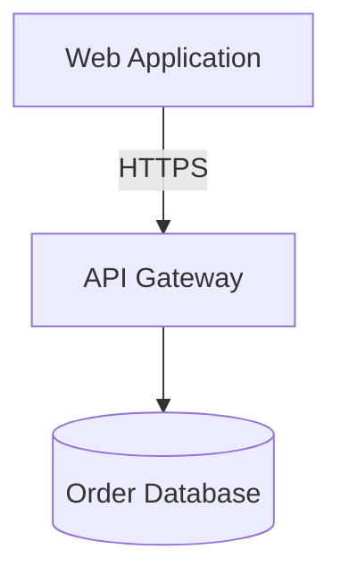
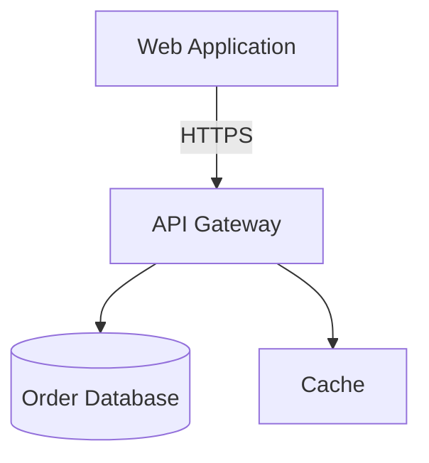

# Obsidian Mermaid Transclusion Test

## Goal

Determine whether Obsidian correctly renders a Mermaid block when that block is
brought into another note via section transclusion.

Decision rule:

- If it works: PR 6 can use `![[diagram-note#Diagram]]` and
  `![[diagram-note#Components]]`
- If it does not work: PR 6 should use inline Mermaid fallback in the deck note

## What You Need

- A machine with Obsidian installed
- A temporary vault folder
- 10-15 minutes
- No repo setup required for the basic gate

## Step 1: Create A Clean Test Vault

1. Make a new empty folder, for example `transclusion-test-vault`
2. Open that folder as a vault in Obsidian
3. Use Reading view for the actual checks, not Source mode

## Step 2: Create The Standalone Diagram Note

Create a file named `diagram-note.md` with exactly this content:

````md
# Diagram Note Test

## Diagram



## Components

| Component | Type | Technology | Confidence |
|-----------|------|------------|------------|
| Web Application | service | React | 0.95 |
| API Gateway | service | Kong | 0.93 |
| Order Database | database | PostgreSQL | 0.91 |

## Connections

| From | To | Label | Direction | Confidence |
|------|----|-------|-----------|------------|
| Web Application | API Gateway | HTTPS | -> | 0.94 |
| API Gateway | Order Database | SQL | -> | 0.90 |
````

## Step 3: Create The Deck Note

Create a file named `deck-note.md` with exactly this content:

```md
# Deck Note Test

## Slide 7

![[diagram-note#Diagram]]

![[diagram-note#Components]]

![[diagram-note#Connections]]

*Full details: [[diagram-note]]*
```

## Step 4: Run The Control Check

Open `diagram-note.md` in Reading view and verify:

1. The Mermaid diagram renders as a diagram, not as raw code
2. The components table renders as a table
3. The connections table renders as a table

Expected result:

- If this fails, the problem is not transclusion. Stop and note that Mermaid
  itself is not rendering in this Obsidian environment.

## Step 5: Run The Actual Transclusion Gate

Open `deck-note.md` in Reading view and verify:

1. The `Diagram` section appears inline inside `deck-note.md`
2. The Mermaid diagram is visibly rendered inside the deck note
3. The `Components` section appears inline as a rendered table
4. The `Connections` section appears inline as a rendered table
5. The `Full details` link opens `diagram-note.md`

Expected pass result:

- You see the actual Mermaid diagram in the deck note
- You do not see raw triple-backtick code
- You do not see only the literal `![[diagram-note#Diagram]]` text
- You do not see an empty or blank transclusion where the Mermaid should be

## Step 6: Edit-Propagation Check

Go back to `diagram-note.md` and change the Mermaid block to this:



Also add this row to the components table:

```md
| Cache | service | Redis | 0.88 |
```

Save, then reopen or refresh `deck-note.md`.

Expected result:

1. The transcluded Mermaid now shows the new `Cache` node
2. The transcluded components table now shows the `Cache` row

## Step 7: Restart Check

1. Close and reopen Obsidian
2. Reopen `deck-note.md`

Expected result:

- The transcluded Mermaid still renders after restart
- The transcluded tables still render after restart

## Pass/Fail Criteria

Call it PASS only if all of these are true:

- Mermaid renders normally in `diagram-note.md`
- Mermaid also renders when transcluded into `deck-note.md`
- Tables transclude correctly
- Edits in the source note propagate to the deck note
- Behavior survives an Obsidian restart

Call it FAIL if any of these happen:

- Transcluded Mermaid shows as raw fenced code
- Transcluded Mermaid area is blank or partially broken
- Only tables transclude, but Mermaid does not
- Mermaid renders in the source note but not in the deck note
- Edit propagation is inconsistent

## Target Output To Report Back

Send back exactly this filled template:

```md
Obsidian transclusion test result

Environment:
- OS:
- Obsidian version:

Checks:
- Source note Mermaid renders: PASS/FAIL
- Deck note transcluded Mermaid renders: PASS/FAIL
- Deck note transcluded components table renders: PASS/FAIL
- Deck note transcluded connections table renders: PASS/FAIL
- Edit propagation works: PASS/FAIL
- Restart persistence works: PASS/FAIL

Decision:
- PASS -> PR 6 uses transclusion (`![[note#section]]`)
- FAIL -> PR 6 uses inline Mermaid fallback

Notes:
- Any visual glitches or caveats:
```

## Recommended Extra Check

If you already have one real PR 5-generated diagram note on that machine,
repeat the same test with a real note after the synthetic test. The synthetic
test is enough for the gate, but one real note gives higher confidence.
