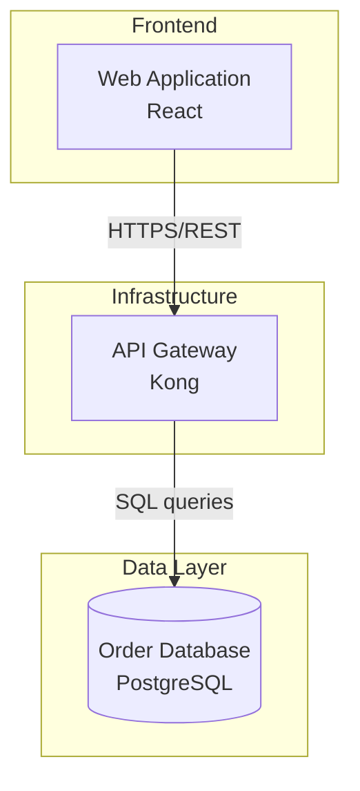

# Proposal: Architecture Diagram Extraction for folio.love

**Date:** 2026-03-14
**Author:** Johnny Oh
**Status:** Final — approved for implementation
**System promise:** Review-first, high-trust extraction pipeline. Extracts diagrams at high quality and flags what needs checking. The system captures learning signals from human review and gets smarter over time. The quality claim strengthens as evidence accumulates.

---

## Known Gaps

Deferred to implementation:

- **Actual prompt text** for extraction, mutation, and claim-level verification (designed and iterated in PR 4 on real diagrams)
- **Standalone note versioning lifecycle details** (designed in PR 6)
- **Batch processing and error recovery** (separate scope item)
- **Multi-diagram pages** (v1 assumes one page = one diagram)

---

## Document Lineage

### Layer 1: Codebase Context Brief
Factual pipeline export from Claude Code with full codebase access. Described current stages, code paths, data structures, configuration, dependencies, and known behavior on diagram PDFs.

### Layer 2: Three Independent Deep Research Reports
Same research prompt run through three tools, labeled blind as Model A, Model G, and Model O. Model A (vision-LLM-primary sufficient, F1 >0.94 on flowcharts). Model G (hybrid strictly necessary, "binding problem"). Model O (hybrid necessary, even hybrid has limits, edge F1 ~0.62 on system maps).

### Layer 3: Research Consolidation
Blind synthesis identifying consensus (Mermaid, 300 DPI, pdfplumber extract_words, PDF object counting), disagreements (hybrid vs vision-only, tiling vs single image, verification depth), and standout findings.

### Layer 4: Codebase Review (Claude Code + Codex)
Key corrections: one-note-per-deck model, `SlideAnalysis` universal type, `_collect_unique()` evidence bug, Pass 2 slide-specific, `ProviderInput` single image, single-hash cache. Effort corrections on blank detection, per-page DPI, and output model.

### Layer 5: Pressure Test Round 1
Three blind reviewers independently found: Pass B must receive images; Mermaid must be generated from verified JSON (not by LLM); fixed-grid tiling bisects components; dual output needs transclusion; mmdc is a ~200MB Chromium dependency with possibly nonexistent `--validate` flag.

### Layer 6: Pressure Test Round 2
Same three reviewers found: Pass B full JSON rewrite causes regressions (use mutations instead); mixed pages collide in `dict[int, SlideAnalysis]`; "zero syntax errors" is overconfident; entity resolution at render time creates non-determinism; coordinate transform needs Y-axis inversion, CropBox, rotation; tiles-for-labels prompting won't reliably bind labels; review gate should be richer.

### Layer 7: Final Approval Round
All three reviewers approved the proposal for implementation. Final-round findings identified six execution-level traps incorporated into this version:

1. **Escalation chicken-and-egg:** Can't use Pass A output to decide Pass A's inputs. Fixed: Stage 1 deterministic data drives Pass A escalation; Pass A output drives Pass B/C escalation.
2. **Stable ID relabeling paradox:** Hash-based IDs break when Pass B relabels a node. Fixed: Arbitrary IDs from Pass A; cross-run stability via spatial IoU matching.
3. **Pass C edge crops don't work geometrically:** Rectangular crops spanning source/target cut orthogonal routing lines. Fixed: Visual highlights on global image instead of rectangular crops.
4. **Pass C concurrency bomb:** 90 sequential calls = 10 minutes; 90 concurrent = rate limit crash. Fixed: Batch claims 15-20 per call.
5. **Sanity check should short-circuit:** If Pass B delta exceeds threshold, don't waste Pass C on a known-bad graph. Fixed: Short-circuit to abstention.
6. **folio_freeze must bypass extraction entirely:** Otherwise deck-level aggregation desyncs from frozen human edits. Fixed: Parse frozen Markdown to hydrate graph.

Additional final-round incorporations: regional completeness sweep for omitted elements, endpoint-level privacy controls, pypdfium2 pinned behind adapter.

### Executive Decisions

- **Architecture:** Model O's hybrid pipeline with corrections from all three pressure test rounds.
- **Image strategy:** Validate Set-of-Mark in PR 1; tiles as fallback.
- **Verification:** Claim-level, batched, with visual highlights.
- **LLM selection:** Test on real corpus during implementation (client agreement obtained).
- **Output model:** Standalone notes + transclusion. Single source of truth.
- **Review gate:** Everything renders, richly flagged with confidence reasoning and specific review questions. System learns from corrections.
- **Stable IDs:** Arbitrary from Pass A; spatial IoU for cross-run binding.
- **Diagram type scope:** System architecture and data flow only. All other types abstain.
- **Governing principle:** Evidence-driven escalation. Not maximum effort by default.
- **System framing:** "Extracts diagrams at high quality and flags what needs checking."
- **Cost posture:** Quality-first, no cost gating. Expected ~$1-4 per diagram page.
- **Privacy:** Client agreement for AI use obtained. Endpoint-level controls required.

---

## Problem Statement

Folio.love cannot meaningfully process standalone PDF files containing architecture diagrams. Four problems:

1. **Text in shapes is lost.** `pdfplumber`'s `page.extract_text()` captures flowing text only. Component labels inside shapes are missing.
2. **Sparse diagrams are destroyed.** Pixel histogram blank detection fires on line-on-white diagrams. The blank override discards correct LLM results and excludes pages from Pass 2.
3. **Schema doesn't fit.** `SlideAnalysis` has consulting slide types and framework options. No diagram fields.
4. **Prompts don't ask the right questions.** `ANALYSIS_PROMPT` asks for consulting classification, not nodes, edges, or flow direction.

---

## Research Consensus (Settled)

All research reports and pressure tests agreed:

- **Mermaid** is the target diagram-as-code format (native Obsidian, MIT, highest LLM reliability)
- **300 DPI** for diagram pages (150 blurs small labels; higher wastes resources)
- **pdfplumber `extract_words()`** replaces `extract_text()` for diagrams
- **PDF object counting** for blank/diagram detection heuristic
- **No heavyweight ML models or GPU OCR** — cloud vision LLMs handle heavy lifting
- **Source image always embedded** as canonical reference
- **Mermaid generated deterministically from verified JSON** — never by the LLM
- **Pass B must receive images** — text-only verification can't check edges or direction

---

## Design Decisions

### Governing Principle: Evidence-Driven Escalation

Not "always maximum effort." Not "minimize cost." The system starts with a standard pass and escalates when evidence indicates insufficiency.

More multimodal context is not monotonic in accuracy. Throwing 5 images at a simple 5-box flowchart can introduce binding noise. Evidence-driven escalation produces better results on simple diagrams (less noise) and complex diagrams (targeted escalation where it matters).

**Escalation is determined at two points:**

**Before Pass A (from Stage 1 deterministic data only):**
You cannot use Pass A's output to judge whether Pass A had sufficient resolution — a dense diagram sent only the global image might hallucinate 8 large boxes and miss 40 small components, reporting itself as "simple."

- If pypdfium2 extracts >30 bounded words OR pdfplumber counts >200 vector lines → Medium/Dense. Escalate to global + tiles/Set-of-Mark for Pass A.
- Otherwise → Simple. Global image only for Pass A.

**Before Pass B/C (from Pass A output):**
- Pass A node count refines the escalation for verification depth.
- Simple (≤10 nodes): claim-level verification with global image.
- Medium (11-25): claim-level verification with local highlights.
- Dense (>25): full claim-level verification with local highlights + regional completeness sweep.

### 1. Extraction Architecture: Extract → Mutate → Verify → Sweep → Render

```
Pass A (Extract):    Global image [+ tiles/SoM if escalated] + PDF text
                     → LLM → canonical graph JSON with arbitrary IDs

Pass B (Mutate):     Graph JSON + global image + text inventory
                     → LLM → targeted mutation list
                     Python applies mutations deterministically.
                     Sanity check: if >30% nodes or >40% edges mutated → short-circuit
                       (skip Pass C, mark abstained + review_required, dump mutations as review_questions)

Pass C (Verify):     Claim-level, batched. Each batch: image with visual highlights + 15-20 claims.
                     Per-claim: confirmed / rejected / uncertain.
                     Per-claim confidence and evidence reference recorded.
                     Rejected claims removed from graph. Uncertain claims generate review questions.

Completeness Sweep:  For dense diagrams only. Per-cluster regional prompt:
                     "What visible components or connections in this region are NOT in the current graph?"
                     Any discovered elements added with low confidence + review flag.

Render:              Verified graph → deterministic Python → Mermaid + prose + tables
```

**Pass B mutation format:**
```json
{
  "mutations": [
    {"action": "add_edge", "source_id": "node_3", "target_id": "node_7", "label": "gRPC", "direction": "->"},
    {"action": "remove_edge", "edge_id": "edge_12", "reason": "not visible in image"},
    {"action": "relabel_node", "node_id": "node_3", "new_label": "Auth Service"},
    {"action": "change_direction", "edge_id": "edge_5", "new_direction": "<->", "reason": "bidirectional arrowheads"},
    {"action": "regroup", "node_id": "node_8", "new_group_id": "group_2", "reason": "visually inside VPC boundary"}
  ]
}
```

Mutations are applied in Python. Untouched nodes and edges are mathematically protected from hallucination. Relabeling a node does NOT change its ID (IDs are arbitrary, not derived from labels).

**Sanity check short-circuit:** If mutations exceed thresholds, the original Pass A graph is fundamentally unreliable. Don't waste Pass C verifying garbage. Mark `abstained: true`, `review_required: true`, dump Pass B's proposed mutations into `review_questions` so the reviewer can see what Pass B thought was wrong, and move on.

**Pass C batched claim verification:** Instead of individual LLM calls per claim (90 calls for a dense diagram = rate limit crash or 10-minute wait), batch 15-20 claims per call. Each call receives an image with visual highlights plus a JSON array of claims, and returns a JSON array of verification results.

**Pass C edge verification with visual highlights:** Rectangular crops spanning source and target don't work — orthogonal routing lines go around other boxes and get cut by the crop. Instead: draw prominent visual highlights (thick semi-transparent colored bounding boxes around the two nodes) directly onto the global image using PIL. Prompt: "Look at the highlighted boxes. Is there a continuous line connecting them? What direction does it flow?"

**Completeness sweep (dense diagrams only):** Pass C verifies existing claims but doesn't search for omissions. If Pass A and Pass B both miss a component, Pass C never finds it. For dense diagrams: after Pass C, take each dense cluster/group and send a localized crop with the prompt "What visible components or connections in this region are NOT in the following list: [current graph elements]?" New discoveries are added with low confidence and flagged for review.

### 2. Image Strategy: Set-of-Mark Primary, Tiles Fallback

**PR 1 validates pypdfium2 bounding box quality on 5-10 real corpus PDFs.**

**If bounding boxes are reliable → Set-of-Mark is primary:**
- Annotate the global 300 DPI image with thin numbered bounding boxes over text regions from pypdfium2
- LLM references components by badge ID: `{"node_id": "node_3", "text_badge_id": 14}`
- Python maps badge ID → exact pypdfium2 text string
- Eliminates the binding problem entirely
- No tiles needed

**If bounding boxes are unreliable → Tiles as fallback:**
- Global image for structure extraction
- Quadrant crops as label-reading references only
- Prompt: "Extract structure from Image 1. Use Images 2-5 to read labels unclear in Image 1."
- Claim-level verification uses visual highlights regardless of strategy

### 3. Stable Element IDs: Arbitrary + Spatial IoU

**Pass A assigns arbitrary IDs:** `node_1`, `node_2`, `edge_1`, etc. These are stable within a single extraction run. Relabeling in Pass B does not change the ID.

**Cross-run stability via spatial IoU:** When re-processing the same page:
1. Pass A produces a new graph with new arbitrary IDs
2. Before replacing the cached graph, compare each new node's bounding box against cached nodes
3. If IoU (Intersection over Union) > 0.80, inherit the cached node's ID
4. Inherited IDs preserve human override bindings across re-extractions
5. Nodes with no IoU match get fresh IDs (genuinely new elements)

**Why not hash-based IDs:** Hashing label + position breaks when Pass B relabels a node (ID changes, orphaning edge references) and drifts when OCR improves or boxes shift slightly between runs. Spatial IoU is robust to label changes and tolerant of small positional shifts.

**Edge IDs:** Derived from source + target node IDs. When node IDs are inherited via IoU, edge IDs are automatically stable.

### 4. Diagram Type Scope: System Architecture and Data Flow Only

v1 handles system architecture and data flow diagrams. Other types (sequence, ERD, org chart, network topology) are classified but abstain: `diagram_type: "unsupported"`, `review_required: true`, source image embedded, note explaining type was detected but extraction not supported in v1.

### 5. Output Model: Standalone Notes + Transclusion

**Standalone diagram notes are the single source of truth.** All structured data, Mermaid, tables, prose, review metadata, and human overrides live here.

**Deck notes use Obsidian transclusion:**
```markdown
### Slide 7


![[20260314-system-design-review-diagram-p007#Diagram]]

![[20260314-system-design-review-diagram-p007#Components]]

*Full details: [[20260314-system-design-review-diagram-p007]]*
```

**Validate transclusion with Mermaid blocks in Obsidian during week 1** (15-minute test). If it doesn't work, fallback: inline Mermaid in deck note generated from the same verified graph.

**`folio_freeze` — full pipeline bypass:**

When a human edits the body of a standalone diagram note, they add `folio_freeze: true` to frontmatter. On re-processing:

1. Stage 1 detects `folio_freeze: true` on the existing note for this page
2. Passes A, B, C are **skipped entirely** — no LLM calls, no cost, no risk of overwriting
3. The pipeline **parses the frozen Markdown** (component tables, connection tables) to hydrate a `DiagramGraph` in memory
4. This hydrated graph feeds deck-level frontmatter aggregation, ensuring deck metadata matches the human's edits
5. YAML metadata on the frozen note is NOT updated (no confidence re-scoring, no extraction metadata changes — the human's version is the authority)

This prevents: (a) deterministic renderer overwriting manual edits, (b) deck-level metadata desyncing from frozen content, (c) wasting LLM budget re-extracting human-locked diagrams.

### 6. Data Model: `DiagramAnalysis(SlideAnalysis)` Subclass

```python
@dataclass
class DiagramAnalysis(SlideAnalysis):
    """Extends SlideAnalysis for polymorphic compatibility."""
    diagram_type: str = "unknown"
    graph: Optional[DiagramGraph] = None
    mermaid: Optional[str] = None               # generated from graph, never from LLM
    description: Optional[str] = None           # generated from graph, strictly graph-bound
    uncertainties: list[str] = field(default_factory=list)
    extraction_confidence: float = 0.0
    confidence_reasoning: str = ""
    review_questions: list[str] = field(default_factory=list)
    review_required: bool = False
    abstained: bool = False

@dataclass
class DiagramGraph:
    nodes: list[DiagramNode] = field(default_factory=list)
    edges: list[DiagramEdge] = field(default_factory=list)
    groups: list[DiagramGroup] = field(default_factory=list)
    schema_version: str = "1.0"

@dataclass
class DiagramNode:
    id: str                         # arbitrary (node_1, node_2); stable via IoU across runs
    label: str
    kind: str = "unknown"           # service, datastore, queue, actor, boundary, unknown
    group_id: Optional[str] = None
    technology: Optional[str] = None
    source_text: str = "vision"     # pdf_native, ocr, vision
    bbox: Optional[tuple[float, float, float, float]] = None  # PDF points
    confidence: float = 1.0
    verification_evidence: Optional[str] = None  # batch ID + claim index

@dataclass
class DiagramEdge:
    id: str                         # derived from source_id + target_id
    source_id: str
    target_id: str
    label: Optional[str] = None
    direction: str = "->"           # ->, <->, undirected, unknown
    confidence: float = 1.0
    evidence_bbox: Optional[tuple[float, float, float, float]] = None
    verification_evidence: Optional[str] = None

@dataclass
class DiagramGroup:
    id: str
    name: str
    contains: list[str] = field(default_factory=list)         # node IDs
    contains_groups: list[str] = field(default_factory=list)   # nested group IDs (recursive)
```

**Nested groups** via `contains_groups` enables recursive subgraph representation (AWS Region → VPC → Subnet). The Mermaid generator handles recursive nesting with a depth limit.

**Mixed pages:** Store one `DiagramAnalysis` object. Text content goes in inherited `SlideAnalysis` fields. Diagram content in diagram fields. One dict entry, no collision.

**Deserialization factory:** `SlideAnalysis.from_dict()` inspects the dict and delegates to `DiagramAnalysis.from_dict()` when diagram fields are present. This is the **first deliverable in PR 3** — grep every call site, verify all go through the factory.

### 7. Review Gate: Everything Renders, Richly Flagged, System Learns

Extractions always render. Low-confidence extractions carry structured metadata for efficient review and continuous improvement.

**Every diagram note includes:**

```yaml
extraction_confidence: 0.72
confidence_reasoning: >
  Pass A extracted 18 nodes and 22 edges. Pass B modified 4 edges
  (2 direction corrections, 1 addition, 1 removal). Claim-level
  verification confirmed 16/18 nodes (89%) and 17/22 edges (77%).
  Two edges in the lower-right cluster could not be verified due to
  overlapping lines. Text inventory coverage: 78%.
review_required: true
review_questions:
  - "Verify connection direction between 'Order Service' and 'Payment Gateway' — arrowhead unclear in source image"
  - "Confirm whether 'Cache Layer' is inside the 'Platform' boundary or adjacent to it"
  - "Two edges near 'Message Queue' overlap — verify which services connect to the queue"
human_overrides: {}
_review_history: []
```

**`review_questions`** are specific, actionable, and generated by the verification pass. An architect answers three questions in 2 minutes instead of re-checking a 20-node diagram from scratch.

**Learning from corrections:** When a reviewer corrects an extraction, the system captures: what was wrong, what the correction was, and original confidence vs actual accuracy. Stored in `_review_history` (append-only). Over time enables: confidence calibration, systematic failure pattern identification, reviewer burden measurement, and model/prompt improvement evaluation.

### 8. Selective Per-Page DPI

Diagram pages at 300 DPI, text pages at 150 DPI. `convert_from_path(first_page=N, last_page=N, dpi=...)` for mixed-DPI decks.

### 9. Coordinate Space Transformation

Full affine transform: Y-axis inversion, CropBox offsets, page rotation.

```python
def pdf_to_pixel(pdf_x: float, pdf_y: float, page: PageProfile) -> tuple[float, float]:
    """PDF points (72 DPI, origin bottom-left) → pixel coords (render DPI, origin top-left)."""
    # CropBox offset
    x = pdf_x - page.crop_box_x0
    y = pdf_y - page.crop_box_y0
    # Page rotation
    if page.rotation == 90:
        x, y = y, page.crop_box_width - x
    elif page.rotation == 180:
        x, y = page.crop_box_width - x, page.crop_box_height - y
    elif page.rotation == 270:
        x, y = page.crop_box_height - y, x
    # Scale + Y-axis inversion
    scale = page.render_dpi / 72.0
    pixel_x = x * scale
    pixel_y = (page.crop_box_height - y) * scale
    return pixel_x, pixel_y
```

**Single geometry authority:** pypdfium2 for all coordinate extraction. Validate alignment between pypdfium2 coordinates and Poppler-rendered images on test fixtures in PR 1. pypdfium2 pinned to a specific version and wrapped behind a thin adapter (beta API may change).

### 10. Confidence Scoring: Dual Path, No Tautological Metrics

**Text-rich PDFs** (pdfplumber extracts >20 words):
- Text inventory coverage: % of extracted words found as node labels
- Claim-level verification pass rate
- Pass B mutation magnitude (large = lower confidence)
- Uncertainty count penalty

**Text-poor PDFs** (≤20 words):
- Claim-level verification pass rate
- Visual density to node ratio (plausible node count for page complexity)
- Pass B mutation magnitude
- Uncertainty count penalty

Mermaid syntax validity is NOT a confidence signal (near-tautological under deterministic generation).

### 11. Mermaid Generation: Deterministic with Sanitization

`graph_to_mermaid()` converts `DiagramGraph` deterministically. Handles nested subgraphs (recursive), node shapes by kind, edge arrows, label sanitization (escape parentheses, brackets, quotes, pipes, reserved keywords, unicode).

**If sanitization fails for a specific element:** Omit that element from Mermaid, add to `uncertainties`, flag for review. The component table still shows the element.

Language: "Highly constrained generation with sanitization." Not "zero errors by construction."

**For CI/development validation:** Use `mermaid.parse()` (the real Mermaid parser) as a test-time check. The deterministic generator targets correctness by construction; the real parser validates in CI. No runtime mmdc dependency.

### 12. Entity Resolution: Technology Labels Only

Wiki-link only `technology` field values: `[[PostgreSQL]]`, `[[React]]`, `[[Kong]]`. Generic labels not linked. No vault scanning. Deterministic. Zero I/O. Vault-aware linking deferred to future enhancement (Obsidian's "Unlinked Mentions" handles discovery).

### 13. Prose Generation: Strictly Graph-Bound

`graph_to_prose()` generates descriptions from the verified graph only. No inferred semantics. If it's not in nodes, edges, or groups, it's not in the prose.

Correct: "Web Application connects to API Gateway via HTTPS/REST."
Incorrect: "The API Gateway centralizes authentication and rate limiting." ← inferred, not in graph.

### 14. Rate Limiting and Retry

Hard prerequisite in PR 2:
- Exponential backoff with jitter on HTTP 429
- Configurable per-provider rate limits in `folio.yaml`
- Per-page retry, max attempts configurable (default: 3)
- Partial progress preservation: completed pages cached even if later pages fail
- Token budget tracking per page and per run

### 15. Cache Versioning: SHA-256

```python
cache_key = sha256_hex(
    prompt_text,
    schema_version,
    render_dpi,
    tiling_strategy_version,
    pipeline_version,
    provider_name,
    model_name,
)
```

Python's `hash()` is NOT stable across interpreter runs. SHA-256 is deterministic and persistent.

### 16. Privacy and Compliance

Client agreement obtained for AI use on engagement diagrams.

**Endpoint-level controls** (not just provider-level): Retention policies vary by API endpoint and feature within the same provider. `folio.yaml` config governs provider AND allowed API surfaces:

```yaml
privacy:
  approved_providers:
    anthropic:
      endpoints: [messages]           # Messages API is ZDR-eligible
      exclude: [message_batches]      # Batches are not ZDR-eligible
    openai:
      endpoints: [chat_completions]
      require_store_false: true       # Responses API retains by default
    google:
      endpoints: [generate_content]
      exclude: [files]                # Files stored 48 hours
```

`_extraction_metadata` documents which provider and endpoint processed each page for compliance auditing.

### 17. Abstention Policy

The system abstains when:
- Diagram type not in v1 scope (not system architecture or data flow)
- Extraction confidence below hard floor (default: 0.40)
- Pass B sanity check trips (>30% nodes or >40% edges mutated — short-circuit, skip Pass C)
- Page appears to be legend, key, or reference card
- Pass C flags fundamental structural uncertainty

Abstained pages produce `DiagramAnalysis` with `abstained: True`, source image embedded, `review_required: True`, and a note explaining why abstention occurred.

---

## System Architecture

### End-to-End Pipeline

```
PDF Input
    │
    ▼
Stage 0: Normalize (existing)
    │
    ▼
Stage 1: Page Inspection (new)
    │   pdfplumber: chars, words, rects, lines, curves
    │   pypdfium2: bounded text, char boxes (pinned version, adapter-wrapped)
    │   Full affine coordinate transform
    │   Classification: blank | image_blank | text | text_light | diagram | mixed | unsupported_diagram
    │   Set-of-Mark viability: are bounding boxes reliable?
    │   Escalation decision (deterministic): word count + vector count → Simple/Medium/Dense
    │   folio_freeze check: if frozen note exists, bypass to Stage 6
    │
    ▼
Stage 2: Image Extraction (modified)
    │   Diagram pages: 300 DPI (rendered individually per page)
    │   Text pages: 150 DPI
    │   If SoM viable: annotate global image with numbered bounding boxes
    │   Else: global overview (~1568px) + quadrant crops
    │   Visual highlight generator for Pass C (PIL-based)
    │
    ▼
Stage 3: Text Extraction (modified)
    │   Text pages: existing extract_text()
    │   Diagram pages: extract_words() + pypdfium2 bounded extraction
    │   Mixed pages: both
    │   Output: SlideText + DiagramTextInventory
    │
    ▼
Stage 4a: LLM Pass A — Extract
    │   Simple: global image only
    │   Medium/Dense: global + tiles/SoM
    │   + text inventory as context
    │   Output: canonical graph JSON with arbitrary node/edge IDs
    │   Spatial IoU matching against cached graph for ID inheritance
    │
    ▼
Stage 4b: LLM Pass B — Mutate
    │   Input: graph JSON + global image + text inventory
    │   Output: targeted mutation list (add/remove/relabel/regroup/change_direction)
    │   Python applies mutations deterministically
    │   Sanity check: >30% nodes or >40% edges changed →
    │     SHORT-CIRCUIT: skip Pass C, mark abstained + review_required,
    │     dump mutations as review_questions
    │
    ▼
Stage 4c: LLM Pass C — Claim-Level Verification (batched)
    │   Batch 15-20 claims per LLM call
    │   Node claims: global image with highlighted bounding box + claim
    │   Edge claims: global image with highlighted source + target boxes + claim
    │   Per-claim: confirmed / rejected / uncertain
    │   Rejected claims removed. Uncertain → review questions.
    │
    ▼
Stage 4d: Completeness Sweep (dense diagrams only)
    │   Per dense cluster: localized crop + "what's missing?"
    │   New discoveries added with low confidence + review flag
    │
    ▼
Stage 4e: Confidence Scoring
    │   Dual path: text-rich or text-poor
    │   Generates confidence_reasoning and review_questions
    │
    ▼
Stage 4f: Deterministic Rendering
    │   graph_to_mermaid() with sanitization + recursive nesting
    │   graph_to_prose() strictly graph-bound
    │   graph_to_tables()
    │   Entity resolution: technology labels only
    │
    ▼
Stage 5: Existing Pass 2 (text/slide pages only)
    │
    ▼
Stage 6: Output Assembly (modified)
    │   Standalone diagram notes: single source of truth
    │   Deck notes: transclusion references (inline Mermaid fallback)
    │   folio_freeze: parse frozen Markdown → hydrate graph → feed aggregation
    │
    ▼
Stage 7: Frontmatter (modified)
    │   Deck: type: evidence, diagram_types, diagram_components
    │   Diagram: type: diagram, full review metadata
    │   _collect_unique(): DiagramAnalysis always included
    │   _generate_tags(): diagram metadata included
    │
    ▼
Stage 8: Source/Version/Registry (extended)
```

### Standalone Diagram Note Structure

```markdown
---
type: diagram
diagram_type: system_architecture
title: "Order Processing System Architecture"
source_deck: "[[20260314-system-design-review]]"
source_page: 7
extraction_confidence: 0.93
confidence_reasoning: >
  Pass A extracted 3 nodes and 2 edges. Pass B made no mutations.
  Claim-level verification confirmed 3/3 nodes and 2/2 edges.
  All labels matched PDF text inventory.
review_required: false
review_questions: []
abstained: false
folio_freeze: false
components:
  - Web Application
  - API Gateway
  - Order Database
technologies:
  - React
  - Kong
  - PostgreSQL
tags:
  - diagram
  - architecture
  - order-processing
human_overrides: {}
_review_history: []
_extraction_metadata:
  model: claude-sonnet-4-20250514
  passes: [extract, mutate, verify]
  text_sources: [pdf_native, vision]
  image_strategy: set_of_mark
  escalation_level: simple
  schema_version: "1.0"
  pipeline_version: "1.0"
  verification_batches: 1
  claims_verified: 5
  claims_confirmed: 5
  claims_rejected: 0
  claims_uncertain: 0
  input_tokens: 14200
  output_tokens: 3800
---

# Order Processing System Architecture

Extracted from [[20260314-system-design-review]], page 7.

## Diagram



## Components

| Component | Type | Technology | Group | Source | Confidence |
|-----------|------|------------|-------|--------|------------|
| Web Application | service | [[React]] | Frontend | pdf_native | 0.98 |
| API Gateway | service | [[Kong]] | Infrastructure | pdf_native | 0.97 |
| Order Database | datastore | [[PostgreSQL]] | Data Layer | vision | 0.93 |

## Connections

| From | To | Label | Direction | Confidence |
|------|----|-------|-----------|------------|
| Web Application | API Gateway | HTTPS/REST | → | 0.96 |
| API Gateway | Order Database | SQL queries | → | 0.94 |

## Summary

Web Application connects to API Gateway via HTTPS/REST.
API Gateway connects to Order Database via SQL queries.
Components organized into Frontend, Infrastructure, and Data Layer groups.

## Extraction Notes

> No uncertainties flagged. All claims confirmed at claim level.

---

![[system-design-review-p007.png]]
```

### Review Queue (Obsidian Dataview)

```dataview
TABLE
  diagram_type AS "Type",
  extraction_confidence AS "Conf",
  length(review_questions) AS "Open Qs",
  source_deck AS "Source"
FROM #diagram
WHERE review_required = true
SORT extraction_confidence ASC
```

---

## Implementation Plan

Seven production-grade PRs. Each independently testable and deployable.

### PR 1: Page Inspection + Blank Fix + Coordinates + Set-of-Mark Validation

**Effort:** 2-2.5 days

**Deliverables:**
- `folio/pipeline/inspect.py` with `inspect_pages()` and `PageProfile`
- Classification: blank | image_blank | text | text_light | diagram | mixed | unsupported_diagram
  - `text_light`: pages with 1–50 words and no vectors/images. Renders at 150 DPI (not 300).
    Prevents short text pages from being misclassified as `diagram` and unnecessarily escalated.
  - `image_blank`: raster-only pages (has images but no text/vectors). Converter combines with
    histogram blank detection to determine final blank status — prevents false diagram classification
    on blank raster scans while protecting sparse vector diagrams.
- Escalation decision from Stage 1 data: word count + vector count → Simple/Medium/Dense
- pypdfium2 integration (pinned version, wrapped behind thin adapter)
- Full affine coordinate transform (Y-axis inversion, CropBox, rotation)
- Set-of-Mark viability: run pypdfium2 on 5-10 real corpus PDFs, measure bounding box coverage
- Validate coordinate alignment between pypdfium2 and Poppler renders
- Blank detection uses PageProfile, not pixel histogram
- Post-LLM blank override gated by PageProfile
- **Week 1 validation:** test Obsidian transclusion with Mermaid blocks (15 minutes)

**Tests:**
- Coordinate transformation (rotated pages, CropBox offsets, Y-axis)
- Classification (each outcome)
- pypdfium2 bounding box extraction
- Integration: sparse diagram NOT overridden with `pending()`
- PDF fixtures: blank, sparse diagram, dense diagram, text, mixed, rotated page

**Decision output:** Set-of-Mark viable → determines PR 2 image strategy.

### PR 2: Provider Abstraction + DPI + Rate Limiting + Image Strategy

**Effort:** 2.5-3 days

**Deliverables:**
- `ProviderInput` with typed `ImagePart` (role, detail settings per provider)
- Provider adapters for multi-image (Anthropic, OpenAI, Google)
  - Anthropic: respect documented size thresholds
  - OpenAI: `detail` parameter per image (`auto` default, `original` when escalated)
  - Google: `media_resolution` parameter
- Per-page DPI rendering: `convert_from_path(first_page=N, last_page=N, dpi=...)`
- Image strategy module:
  - If SoM viable: annotate global image with numbered bounding boxes
  - Else: global overview + quadrant crops
  - Targeted crop generation from coordinates
- Visual highlight generator for Pass C (PIL: colored bounding boxes on images)
- Rate limiting: exponential backoff with jitter, per-provider config, partial progress
- Retry logic: per-page, configurable max attempts

**Tests:**
- Provider tests for multi-image (all three providers)
- Per-page DPI rendering
- SoM annotation (if viable) / tiling (if fallback)
- Visual highlight generation
- Rate limiting behavior

### PR 3: Schema + Routing + Cache + Deserialization

**Effort:** 2-2.5 days

**First deliverable:** `SlideAnalysis.from_dict()` as factory → delegates to `DiagramAnalysis.from_dict()`. Grep every call site. Verify all go through factory.

**Remaining deliverables:**
- `DiagramAnalysis(SlideAnalysis)` with `DiagramGraph`, `DiagramNode`, `DiagramEdge`, `DiagramGroup`
- Arbitrary element IDs (not hash-based)
- Spatial IoU matching for cross-run ID inheritance
- Nested groups: `contains_groups` for recursive containment
- `isinstance` routing in converter
- Diagram pages excluded from Pass 2
- Mixed pages: one `DiagramAnalysis` with text in inherited fields
- Cache: SHA-256 composite key (prompt, schema, DPI, pipeline version, provider, model)

**Tests:**
- Serialization round-trip (both types)
- Factory deserialization (both types, edge cases)
- Spatial IoU matching (inheritance, fresh IDs, edge cases)
- isinstance routing
- Mixed page storage
- Cache key stability (SHA-256 determinism)
- Cache invalidation on version change

### PR 4: Extraction Prompts + Pass A/B/C + Completeness Sweep + Confidence

**Effort:** 5-7 days (the creative, iterative PR — may split if needed by day 3)

**Deliverables:**
- `DIAGRAM_EXTRACTION_PROMPT` (Pass A): designed and iterated on real corpus
- `DIAGRAM_MUTATION_PROMPT` (Pass B): visual critic, outputs mutation list
- `DIAGRAM_CLAIM_VERIFICATION_PROMPT` (Pass C): batched per-claim verification
- `DIAGRAM_COMPLETENESS_PROMPT`: regional sweep for dense diagrams
- Evidence-driven escalation: Stage 1 signals → Pass A image strategy; Pass A output → Pass B/C depth
- Pass A implementation with arbitrary ID assignment
- Pass B mutation parsing and deterministic application
- Pass B sanity check with short-circuit (skip C, mark abstained)
- Pass C batched claim verification (15-20 claims per call, visual highlights)
- Completeness sweep for dense diagrams
- Confidence scoring: dual-path (text-rich / text-poor)
- `confidence_reasoning` generation
- `review_questions` generation from uncertain/rejected claims
- Abstention logic

**Tests:**
- Mock LLM tests for graph JSON parsing
- Mock LLM tests for mutation parsing and application
- Mock LLM tests for batched claim verification
- Sanity check short-circuit behavior
- Confidence scoring (both paths)
- Abstention triggers
- Integration with real diagrams

### PR 5: Deterministic Rendering + Mermaid + Entity Resolution

**Effort:** 2-2.5 days

**Deliverables:**
- `graph_to_mermaid()`: deterministic, recursive nesting, label sanitization
  - Handles: nested groups via `contains_groups`, node shapes, edge arrows, special characters
  - Fallback: unsanitizable element omitted from Mermaid, added to uncertainties
  - Depth limit on recursive nesting
- `graph_to_prose()`: strictly graph-bound
- `graph_to_component_table()` / `graph_to_connection_table()`
- Entity resolution: technology labels wiki-linked only
- **CI validation:** Use `mermaid.parse()` (real parser) in test suite to validate generated Mermaid

**Tests:**
- Mermaid generation (various topologies, nested groups, complex edges)
- Sanitization (parentheses, brackets, quotes, pipes, reserved words, unicode)
- Recursive nesting depth limit
- Prose (no inferred semantics)
- Entity resolution rules
- Snapshot tests: known graphs → expected output
- CI: `mermaid.parse()` validates all generated Mermaid in test suite

### PR 6: Output Assembly + Frontmatter + Standalone Notes + Freeze

**Effort:** 3-3.5 days

**Deliverables:**
- Standalone diagram note emitter with full frontmatter
  - type: diagram, confidence_reasoning, review_questions, _review_history
  - human_overrides preserved via existing_frontmatter
- `folio_freeze` full pipeline bypass:
  - Detect frozen note in Stage 1
  - Skip Passes A/B/C entirely
  - Parse frozen Markdown tables → hydrate DiagramGraph in memory
  - Feed hydrated graph to deck-level aggregation
  - Do NOT update frozen note YAML
- `type: diagram` added to frontmatter validator
- Deck note transclusion (with inline Mermaid fallback if transclusion doesn't render)
- Deck-level frontmatter: diagram_types, diagram_components
- `_collect_unique()`: DiagramAnalysis always included
- `_generate_tags()`: diagram metadata included
- `_review_history` append-only list
- Standalone note versioning: update existing, preserve overrides, IoU-based ID inheritance

**Tests:**
- Standalone note generation (full content)
- folio_freeze bypass (extraction skipped, graph hydrated from Markdown, aggregation correct)
- Transclusion in deck note (or inline fallback)
- Frontmatter with mixed diagram/slide analyses
- Tag generation, `_collect_unique()` with vision-only evidence
- Re-processing: human overrides preserved, IoU ID inheritance
- Integration: full pipeline → deck note + standalone notes

### Model Comparison Testing (After PR 5)

**Effort:** 7-9 days

Runs after PR 5 so evaluation covers extraction quality AND rendered output quality.

**Corpus:** 20-30 diagram pages from actual engagement materials. System architecture and data flow only.

**Ground-truth annotation (4-5 days):**
- Define annotation rules before starting
- Two annotators on 5-page subset for inter-annotator agreement
- Complete node list, edge list with direction, groupings

**Pipeline runs and analysis (3-4 days):**
- 75+ runs (25 diagrams × 3 models)
- Models: Claude Sonnet 4.6, GPT-4o/5.4, Gemini 2.5/3.1 Pro

**Evaluation metrics (weighted operational rubric):**
- Node label recall and precision
- Edge recall and precision
- Edge direction accuracy
- Exact-label fidelity (no paraphrasing)
- Claim-level verification pass rate
- Confidence calibration
- Abstention precision
- Stability across retries
- Reviewer correction burden per page
- Rendered Mermaid quality in Obsidian
- Cost per page
- Latency per page
- Privacy/compliance fit

**Selection:** Quality primary. Cost, latency, stability, compliance fit as secondary.

---

## Expected Cost and Time

Estimates for visibility. The system escalates when evidence warrants.

### Expected Per-Page Cost (Diagram Pages)

| Complexity | Pass A | Pass B | Pass C (batched) | Sweep | Total |
|-----------|--------|--------|-------------------|-------|-------|
| Simple (≤10 components) | $0.20-0.40 | $0.10-0.20 | $0.15-0.30 | — | **$0.50-0.90** |
| Medium (11-25) | $0.30-0.60 | $0.15-0.25 | $0.40-0.80 | — | **$0.85-1.65** |
| Dense (25+) | $0.40-0.80 | $0.15-0.30 | $0.80-2.00 | $0.20-0.50 | **$1.55-3.60** |

100 diagram pages (mixed complexity): **~$100-250 in LLM costs.**

### Expected Processing Time Per Page

| Complexity | Expected time |
|-----------|---------------|
| Simple | 25-50 seconds |
| Medium | 50-120 seconds |
| Dense | 120-300 seconds |

100-page batch: **~2-5 hours.**

### Implementation Effort

| PR | Effort | Cumulative |
|----|--------|------------|
| PR 1: Page Inspection + Coordinates + SoM Validation | 2-2.5 days | 2-2.5 days |
| PR 2: Provider Abstraction + DPI + Rate Limiting | 2.5-3 days | 4.5-5.5 days |
| PR 3: Schema + Routing + Cache | 2-2.5 days | 6.5-8 days |
| PR 4: Prompts + Pass A/B/C + Confidence | 5-7 days | 11.5-15 days |
| PR 5: Deterministic Rendering + Mermaid | 2-2.5 days | 13.5-17.5 days |
| PR 6: Output Assembly + Standalone Notes + Freeze | 3-3.5 days | 16.5-21 days |
| Model comparison testing | 7-9 days | 23.5-30 days |
| **Total** | **~24-30 working days** |

---

## Risk Register

| Risk | Likelihood | Impact | Mitigation |
|------|-----------|--------|------------|
| Blank override destroys valid LLM output | **Certain** (active) | **Critical** | PR 1 |
| Pass B mutations cause regressions | Medium | High | Deterministic application; sanity check short-circuits |
| Pass A underestimates complexity (escalation chicken-and-egg) | Medium | High | Stage 1 deterministic escalation, not Pass A output |
| Edge verification crops cut routing lines | **Certain** (if rect crops) | High | Visual highlights, not rectangular crops |
| Pass C rate limit crash | **Certain** (if unbatched) | High | Batched 15-20 claims per call |
| Verifying known-bad graph after sanity check | **Certain** (if not short-circuited) | Medium | Short-circuit skips Pass C on high-delta |
| folio_freeze desyncs deck metadata | **Certain** (if not bypassed) | High | Full pipeline bypass; parse frozen Markdown |
| Node ID relabeling breaks edge references | **Certain** (if hash-based) | High | Arbitrary IDs; IoU for cross-run stability |
| Coordinate transform wrong (Y-axis, rotation, CropBox) | **Certain** if untested | High | Full affine; validated in PR 1 |
| pypdfium2 bounding boxes unreliable | Medium | Medium | Validated PR 1; tiles as fallback |
| Transclusion doesn't render Mermaid | Medium | Medium | Validated week 1; inline fallback |
| Mermaid sanitization misses edge cases | High | Medium | Omit element + flag; CI validation with real parser |
| Nested groups produce invalid Mermaid | Medium | Medium | Recursive generator with depth limit |
| Mixed page dict collision | **Certain** if unfixed | High | One DiagramAnalysis per page |
| Deserialization drops diagram data | Medium | High | Factory pattern; all call sites verified PR 3 |
| Python hash() unstable for cache | **Certain** | High | SHA-256 |
| API rate limits on batch processing | High | Medium | Rate limiting + retry in PR 2 |
| Prose hallucinates semantics | Medium | High | Strictly graph-bound generation |
| Wiki-link pollution | High | Medium | Technology labels only |
| Completeness gap (missed elements) | Medium | Medium | Regional sweep for dense diagrams |
| PR 4 exceeds estimate | High | Medium | May split by day 3; buffer in timeline |
| pypdfium2 beta API breaks | Medium | Medium | Pinned version; thin adapter |
| Privacy endpoint misconfiguration | Medium | High | Endpoint-level controls in folio.yaml |

---

## Success Criteria

1. **Zero diagram pages destroyed.** No page overridden with `pending()`.
2. **Node label recall > 95%** on test corpus.
3. **Edge recall > 85%** simple/medium, **> 70%** dense.
4. **Edge direction accuracy > 90%** on detected edges.
5. **Mermaid syntactically valid > 99%** (deterministic + sanitization; CI-validated with real parser).
6. **Every diagram page** produces a standalone note or explicit abstention.
7. **Every extraction includes** confidence_reasoning and review_questions.
8. **Claim-level verification** on every node and edge.
9. **Human overrides preserved** across re-processing (folio_freeze + IoU ID inheritance).
10. **No regressions** on existing 506-test suite.
11. **Model comparison completed** with weighted operational rubric.
12. **Confidence calibration measured** on test corpus.
13. **Privacy/compliance confirmed** with endpoint-level controls.
14. **Review history captured** for continuous learning.
15. **System honestly framed:** "Extracts at high quality and flags what needs checking."
